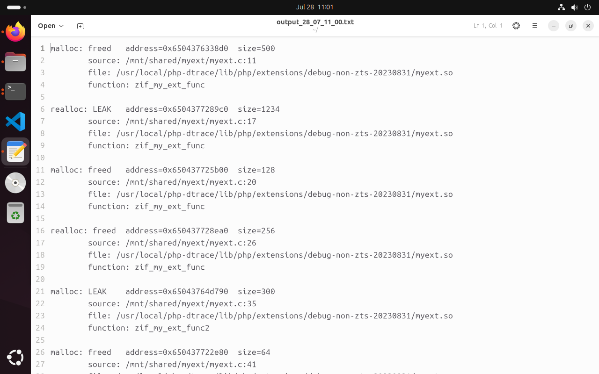

# memleak_catch

memleak_catch is a tool that monitors memory allocations and leaks done by the PHP extensions in the runtime. It uses eBPF (extended Berkeley Packet Filter) technology. For detailed explanation of how the tool works, visit [here](https://medium.com/@psy_maestro/ebpf-based-php-extension-memory-leak-runtime-monitoring-9a88cbe58e76).

It traces Uprobes malloc, calloc, realloc, free and Uretprobes malloc, calloc, and realloc. It creates a file in the currently working directory named output_{day}_{month}_{hour}_{minute}.txt and the output is like the following: 

It doesn't trace PHP's specific functions like emalloc, ecalloc, erealloc, or efree. These functions generally do not call system's memory allocation functions. Therefore, if you used emalloc, ecalloc, erealloc, or efree functions in your PHP extension, it won't log those functions. 

## Building and Running Commands
- make install
- memleak_catch

## Notes
- php has to be compiled with `--enable-fpm` configuration.
- If the php-fpm application is started after this tool is started to trace, it won't catch it since this tool initially capture all the php-fpm processes and then traces them. 
- It only captures the PHP extension's memory allocation functions (malloc, calloc, realloc). It filters out the system memory allocations.
- Since the OS doesn't allocate the memory if that memory is not used, we won't see it in the logs. This isn't important since the OS doesn't allocate at all.
